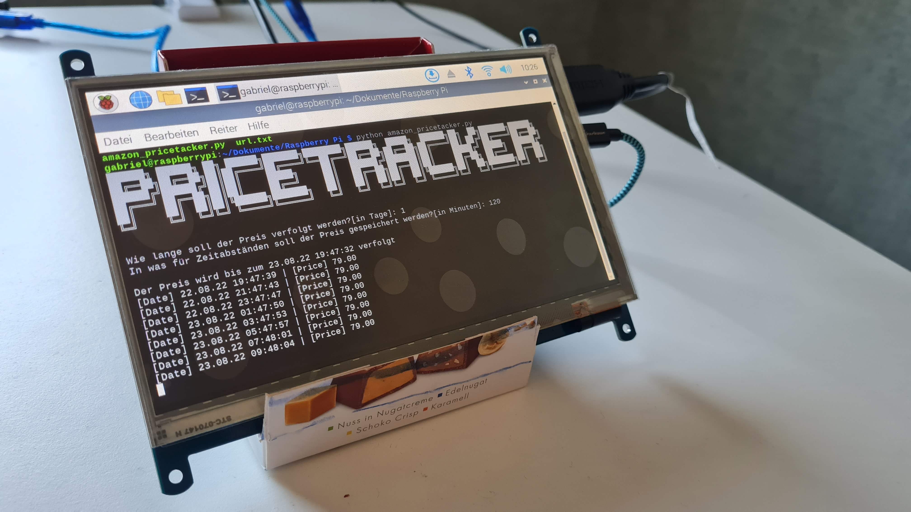
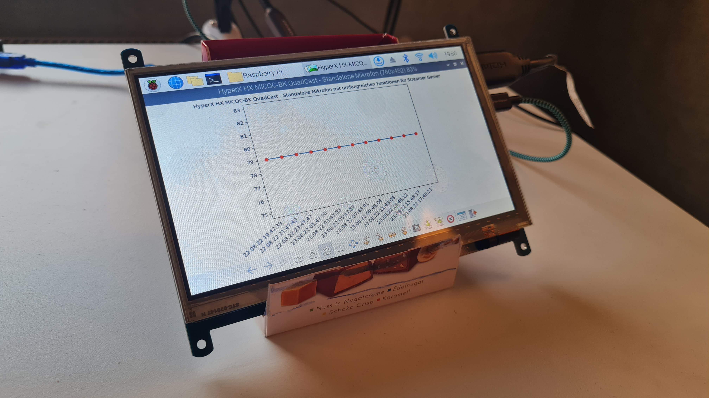
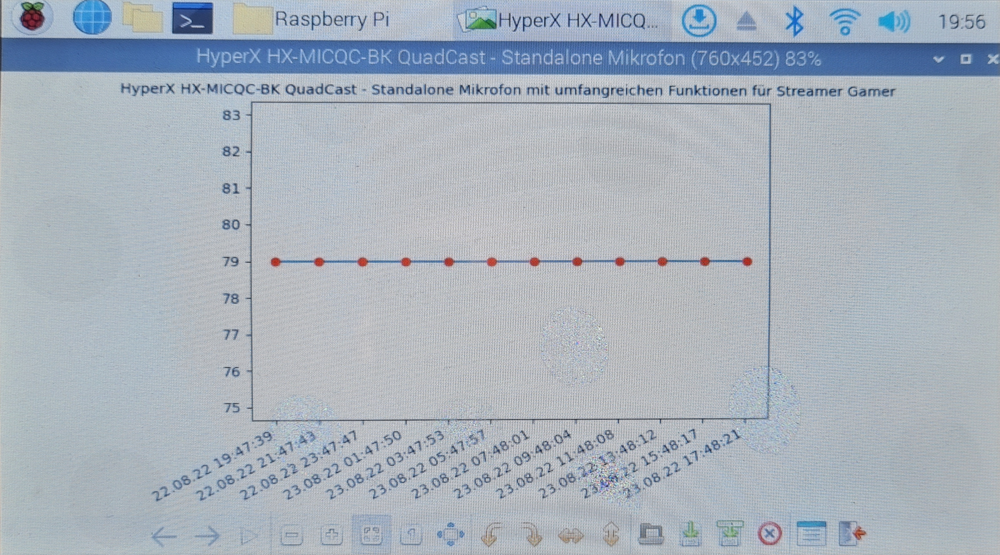

# Price Tracker
Das ist ein Price Tracker, der die Preise gegebener Amazon Produkte verfolgt. Nachdem das Programm fertig ist, wird der Preisverlauf grafisch dargestellt und als .png gespeichert. Ich habe das Script auf meinem neuen Raspberry Pi 4 B 4GB für einen Tag laufen lassen. Der Preis wird alle 120 Minuten gespeichert.


#### Der Price Tracker gibt Infos über den Preis zur Laufzeit an.
Wenn das "Enddatum" erreicht ist, erstellt das Programm automatisch eine grafische Darstellung des Preisverlaufes und speichert diese als .png. Das Ergebnis sieht so aus:



# Setup
## 1. Erstelle eine Datei mit dem Namen ```url.txt``` in dem selben Ordner, in dem das Script liegt
## 2. Und schon kannst du das Script ausführen. Dort musst du nur noch angeben, 1. wie lange das Script laufen soll und 2. in was für Zeitabständen der Preis gespeichert werden soll.
## 3. Nach dem das "Enddatum" erreicht wurde, kannst du dir den Preisverlauf in {name_des_produktes}.png ansehen.
